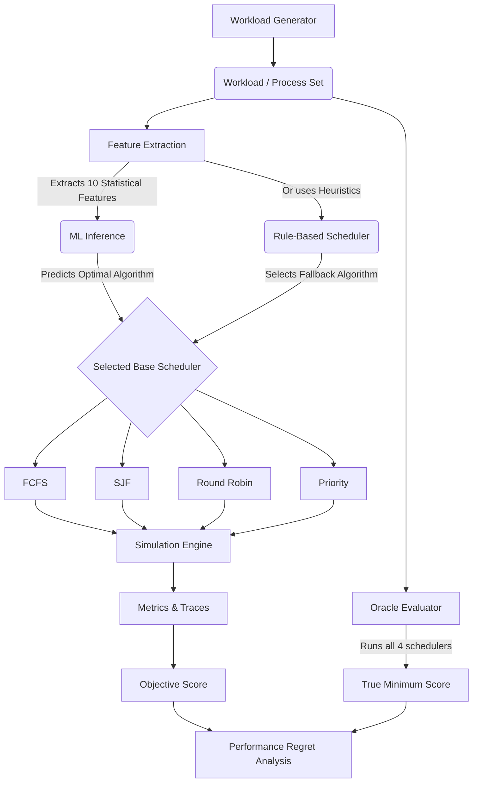

# ML-Based Adaptive CPU Scheduling Framework

Can a machine-learning model dynamically select an appropriate CPU scheduling algorithm for an unseen workload while achieving performance close to the mathematically optimal Oracle scheduler? 

This project demonstrates a hybrid scheduling architecture: **The ML model does not replace the scheduler; it selects one of four base CPU schedulers based on pre-execution workload statistics.**

---

## Architecture Overview



## Base Schedulers Supported
1. **FCFS (First-Come, First-Served):** Non-preemptive FIFO queue.
2. **SJF (Shortest Job First):** Non-preemptive. Selects the shortest burst time currently available.
3. **Round Robin (RR):** Preemptive scheduling using a configurable time quantum.
4. **Priority:** Non-preemptive. Selects the process with the highest priority (1 = highest).

## Workload Generation
The CPU workloads are synthetically generated using randomized statistical distributions (`ShortJobHeavy`, `LongJobHeavy`, `CpuHeavy`, `Bimodal`, `Mixed`, `HighArrivalRate`, `LowArrivalRate`, `PriorityHeavy`). 
A single **Dataset Row** represents an entire Workload.

### 10 Workload Features (ML Input)
Features are extracted in $O(N)$ time *before* execution, preventing target leakage:
1. `num_processes`
2. `average_burst`
3. `burst_std`
4. `min_burst`
5. `max_burst`
6. `arrival_rate`
7. `average_priority`
8. `priority_std`
9. `short_job_ratio`
10. `long_job_ratio`

## Machine Learning Pipeline
- **Target Label:** The empirically best scheduler for that specific workload.
- **Preprocessing:** 80/20 train-test split at the *workload level*. 10-feature vector scaled using `StandardScaler` (fitted exclusively on the training set).
- **Model Evaluation:** Logistic Regression, Decision Trees, and Random Forests were evaluated. **Random Forest Classifier** was selected as the final production model due to highest accuracy and non-linear feature handling.
- **Artifacts:** `best_model.joblib`, `scaler.joblib`, `label_mapping.json`.

## Objective Function
To determine the "optimal" scheduler, an Oracle calculates the maximum possible bounds for a given workload and scales the metrics. The score is minimized.

**Objective Score** = 
`0.40 * normalized_waiting` + `0.30 * normalized_response` + `0.20 * normalized_turnaround` + `0.10 * normalized_context_switches`

*Note: These weights are project-defined. A lower score is mathematically superior.*

## Results

*Metrics derived from actual experimental data (see `results/final_results.csv` and `results/final_experiment_summary.csv`).*

### Model Classification Performance
- **Model:** Random Forest
- **Generalization Accuracy (Unseen Seed):** 85.0%
- **Weighted F1 Score:** ~0.80

### Scheduling Performance (Regret)
The ultimate measure of success is **Performance Regret**: `((Adaptive Score - Oracle Score) / Oracle Score) * 100`.

| Scheduler Strategy | Average Regret | Median Regret | Zero Regret % | Within 5% of Oracle |
| :--- | :--- | :--- | :--- | :--- |
| **Rule-Based Adaptive** | 23.86% | 14.6% | 10% | 30% |
| **ML-Based Adaptive** | **3.55%** | **0.0%** | **65%** | **85%** |

### Sensitivity Experiments
1. **Generalization:** Tested on a completely distinct seed (2026), the ML model maintained a highly stable 8.46% Average Regret, proving it learned queueing mechanics rather than memorizing arrays.
2. **Feature Ablation:** Dropping `short_job_ratio` and `average_burst` severely degraded the model, causing huge Regret spikes and proving their necessity.
3. **Objective-Weight Sensitivity:** When the definition of "optimal" was arbitrarily shifted to heavily penalize Context Switches, the ML model's Regret increased (as expected, since it was trained on the baseline objective).
4. **Training-Size Sensitivity:** Data efficiency analysis showed that diminishing returns kick in rapidly; training on 500+ workloads establishes a stable Regret floor.

## Reproducibility & Commands

### Prerequisites
- C++17 Compiler (`g++`)
- Python 3.9+
- `pip install -r requirements.txt`

### Build C++ Simulator
```bash
g++ -std=c++17 -Icpp/include cpp/src/*.cpp cpp/src/schedulers/*.cpp -o scheduler.exe
```

### Run Pipeline
```bash
# 1. Run Python Unit Tests
python -m pytest ml/tests/

# 2. Run Final Research Experiments
python experiments/run_step15.py --experiment generalization
python experiments/run_step15.py --experiment weights
python experiments/run_step15.py --experiment ablation
python experiments/run_step15.py --experiment training-size

# 3. Generate Tables & Plots
python ml/generate_final_tables.py
python ml/plot_final_results.py
```

### Output Directories
- `results/summaries/`: CSV datasets and tables.
- `results/figures/final/`: Matplotlib generated PNG graphs.

## Limitations
1. **Simulator-Level:** This is evaluated in discrete time ticks in user space, not via eBPF or kernel-level hooks.
2. **Synthetic Data:** Relies on statistical generations rather than real Datacenter/Google Borg traces.
3. **Abstract Overhead:** Context switching overhead is scored mathematically, not via true CPU cache invalidation metrics.
4. **Static Objective:** The 40/30/20/10 weighting scheme is arbitrary; in reality, different workloads require dynamic SLA objectives.

## Future Work
- Integration of Preemptive SJF (Shortest Remaining Time First).
- Expanding to Multicore/SMP scheduling models.
- Adding I/O bound blocking states.
- Reinforcement Learning algorithms to dynamically adjust the objective weights mid-execution.

---
### Documentation Index
- [Resume Overview](docs/resume_description.md)
- [Interview Q&A](docs/interview_questions.md)
- [Project Status](PROJECT_STATUS.md)
- [Final Summaries](results/final_summary.md)
